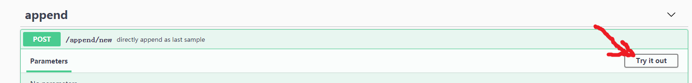
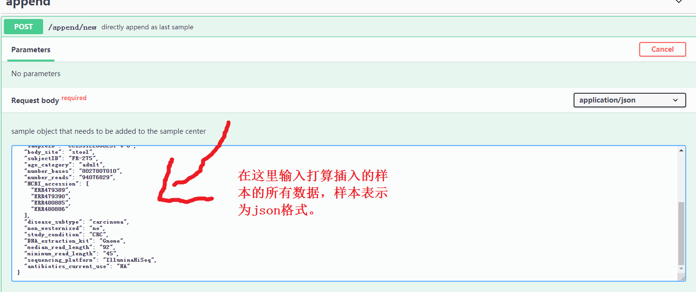
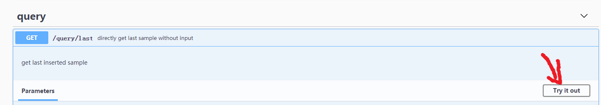
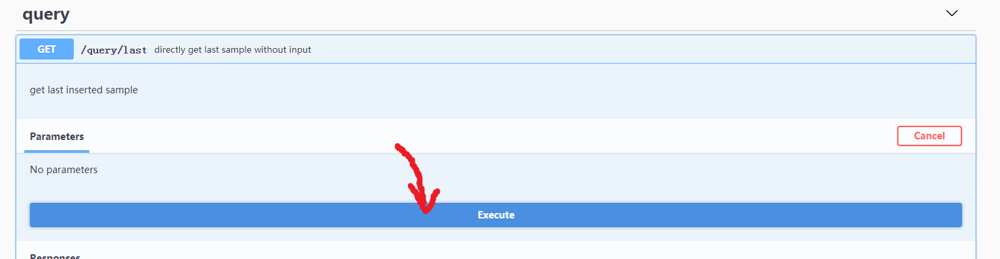
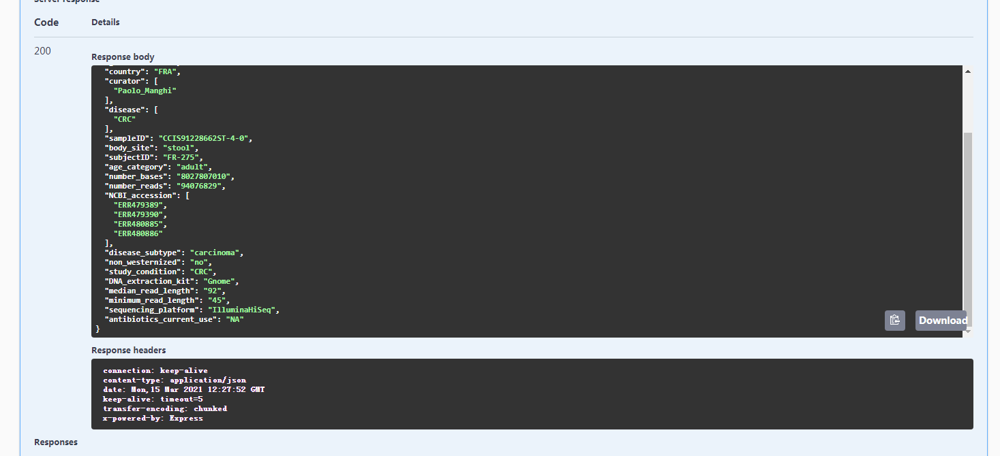
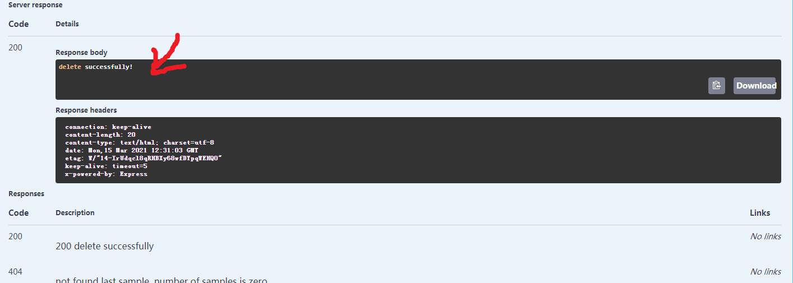

# Why do we test sample addition and sample deletion together?

Because we can keep the database status consistent between sample addition and deletion. It is good for multiple test.

# Sample Addition

### Web link of API documents

[http://54.167.115.100/api-docs/#/](http://54.167.115.100/api-docs/#/)

### Test sample addition API

## Prepare data

### Click "Try it out"

### Paste data in json format (use example data)

## Insert sample

### Send sample data to the server

### Check response

# Query the latest added data

## Next

## Last

## Result

It shows what we insert from [step 1](#sample data) sample data.

# Delete the latest added data

## Result

We delete the sample data we just inserted.
