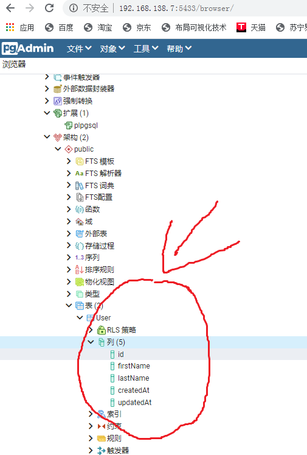

# 目的和动机

今天的主要目的是研究ORM框架sequelize的用法和用途，意在提高生产力。

## 主要参考资料

[https://zhuanlan.zhihu.com/p/125011334](https://zhuanlan.zhihu.com/p/125011334)

[https://www.cnblogs.com/renxiao1218/p/9531512.html](https://www.cnblogs.com/renxiao1218/p/9531512.html)

[入门](https://semlinker.com/node-sequelize-quickstart/)

[数据对象之间的一一对应关系如何提现](http://semlinker.com/node-sequelize-1v1/)

## 必须要的包

```
sequelize pg
```

### 安装指令

```bash
npm install sequelize -S
npm install pg -S
```

## 使用sequelize的基本步骤

- 连接数据库
- 定义模型
- 建表
- 增删改查

# 连接数据库

## 可重用代码(./SequelizeCreator.ts)

```typescript
import {Dialect,Sequelize} from 'sequelize';

export class DBConfigBase {
    //1.这个负责提供连接数据库所必须的主机名
    protected getHostName(): string {
        return process.env.DB_HOST || "localhost";
    }

    //2.这个负责提供连接数据库必须的端口号
    protected getPort(): number {
        return 5432;
    }

    //3.这个负责提供连接数据库必须的用户名
    protected getUserName(): string {
        return process.env.DB_USER || "postgres";
    }

    //4.这个负责提供连接数据库必须的密码
    protected getPassword(): string {
        return process.env.DB_PWD || "docker";
    }

    //5.这个负责提供链接数据库所必须的库名(因为一台数据库服务器上存在多个数据库)
    protected getDatabaseName(): string {
        return process.env.DB_NAME || "cmgd2";
    }

    //6.数据库类型
    protected getDialect(): Dialect {
        return "postgres";
    }

    //以上六个信息是主要信息
    public getConfig(): Object {
        return {
            //以下六个信息是主要信息(目前允许使用者定制)
            host: this.getHostName(),
            port: this.getPort(),
            user: this.getUserName(),
            password: this.getPassword(),
            database: this.getDatabaseName(),
            dialect: this.getDialect()
        }
    }

    //以下信息是调试用的，用来显示连接器所使用的信息
    public showConfig(): void {
        console.log(this.getConfig());
    }

    //以下方法用来创建Sequelize对象
    public CreateSequelize(): Sequelize {
        var result: Sequelize = new Sequelize(//
            this.getDatabaseName(), this.getUserName(), this.getPassword(),//
            {
                host: this.getHostName(),
                port: this.getPort(),
                dialect: this.getDialect(),
                define: {
                    //freezeTableName: 默认为false。
                    // 当为false时，如果你数据库中已有表a的话，sequelize会修改你的表名。
                    // 我测试的结果是帮我的表名"a" 加了个s，导致我查询表a的数据时，总会报不存在该表。
                    freezeTableName: true,
                    //timestamps: 默认为true。
                    // 它会为你的表添加两个额外的字段“createdAt”、"updatedAt"。
                    timestamps:true
                }
            }
            );
        return result;
    }
}

//何飞个人的数据库配置信息
export class DBConfigOfHefei extends DBConfigBase {
    //1.我架设的数据库服务器不在本机，而在192.168.142.7上面,所以覆盖基类中的定义
    protected getHostName(): string {
        return "192.168.142.7"
    }

    //5.这个负责提供链接数据库所必须的库名(因为一台数据库服务器上存在多个数据库)
    protected getDatabaseName(): string {
        return "postgres";
    }

}
```

## 用法演示

### 何飞的数据库

```typescript
import {DBConfigOfHefei} from "./SequelizeCreator"
import {Model,DataTypes,Sequelize} from "sequelize"


var dbc = new DBConfigOfHefei();
//下面这句是调试时定位错误专用的，发布产品的时候注释掉即可(不会影响功能)
dbc.showConfig();
var seq=dbc.CreateSequelize();
```

### 默认的数据库

```typescript
import {DBConfigOfHefei} from "./SequelizeCreator"
import {Model,DataTypes,Sequelize} from "sequelize"

var dbc = new DBConfigBase();
//下面这句是调试时定位错误专用的，发布产品的时候注释掉即可(不会影响功能)
dbc.showConfig();
var seq=dbc.CreateSequelize();
```

### 剪短写法1

```typescript
import {DBConfigOfHefei} from "./SequelizeCreator"
import {Model,DataTypes,Sequelize} from "sequelize"

//何飞的数据库
var seq=new DBConfigOfHefei().CreateSequelize();
//默认的数据库
var seq=new DBConfigBase().CreateSequelize();
```

# 模型

## 什么是模型

在MVC设计模式中，模型用来表示数据(严格的说，应该叫做数据对象。也就是对象形式的数据，而非我们看到的其它格式的数据)。

## sequelize的模型

用来定义内存中的数据对象(Data Object)与DB服务器中的Table(也叫做关系)之间的映射关系。

这也是称sequelize为ORM(对象关系映射)框架的原因之一。

### 模型的地位

模型是`Sequelize`的精华

一个模型是数据库里表的抽象。在`Sequelize`里，它是`Model`的子类。

### 模型中存储的有哪些信息

模型告诉`Sequelize`它代表的若干内容，比如表的名字，以及字段。

### 模型的命名约定

`Sequelize`里的模型都有一个名字。名字不一定要和它代表的表名一样。一般来说，模型的名字是单数形式的名词，比如User，而表名是复数形式的名词，比如`Users`。

### 模型的两种义方法是等效的

在`Sequelize`里有两种等效的方式定义模型

- 调用`Sequelize.define(modelName, attributes, options)`
- 继承Model，并调用`init(attributes, options)`

模型定义后，在`Sequelize.models`里能找到它名字。

## 使用Sequelize.define定义模型

### 演示代码

```typescript
"use strict";
Object.defineProperty(exports, "__esModule", { value: true });
var SequelizeCreator_1 = require("./SequelizeCreator");
var sequelize_1 = require("sequelize");
var objSeq = new SequelizeCreator_1.DBConfigOfHefei().CreateSequelize();
//用户模型(前缀mdl是Model的缩写)
var mdlUser = objSeq.define('User' //模型名(一般情况下就是表的名字了,最多差一个复数s)
, {
    //列名(也叫属性名)
    firstName: {
        type: sequelize_1.DataTypes.STRING //数据类型
        ,
        allowNull: false //允许为空?
    },
    lastName: {
        type: sequelize_1.DataTypes.STRING
        // 默认允许null
    }
}, {});
//以下这句就完成了数据库中表的创建
mdlUser.sync();
//# sourceMappingURL=index.js.map
```

### 执行结果

```bash
Executing (default): CREATE TABLE IF NOT EXISTS "User" ("id"   SERIAL , "firstName" VARCHAR(255) NOT NULL, "lastName" VARCHAR(255), "createdAt" TIMESTAMP WITH TIME ZONE NOT NULL, "updatedAt" TIMESTAMP WITH TIME ZONE NOT NULL, PRIMA
RY KEY ("id"));
Executing (default): SELECT i.relname AS name, ix.indisprimary AS primary, ix.indisunique AS unique, ix.indkey AS indkey, array_agg(a.attnum) as column_indexes, array_agg(a.attname) AS column_names, pg_get_indexdef(ix.indexrelid) A
S definition FROM pg_class t, pg_class i, pg_index ix, pg_attribute a WHERE t.oid = ix.indrelid AND i.oid = ix.indexrelid AND a.attrelid = t.oid AND t.relkind = 'r' and t.relname = 'User' GROUP BY i.relname, ix.indexrelid, ix.indis
primary, ix.indisunique, ix.indkey ORDER BY i.relname;

Process finished with exit code 0
```

对于以上那么多的输出，我们只需要知道：exit code 0即可。

说明，没有出错啊。

### 查看数据库中的效果



# 建表

其实，在上面的代码我们已经很粗略的见过了。就是[演示代码](#演示代码)的最后一句。

## 模型的同步可以完成建表

可以通过异步方法`model.sync(options)`来让模型和数据库之间同步。

### 什么是模型同步

这就牵涉到模型同步(所谓的模型的同步特指在功能上：让数据库里面的信息和JavaScript里面的保持一致，如果不一致那么就调整数据库里面的)。

### 异步方法在此处强调的什么

异步方法是指调用这个方法后，方法不会立即返回执行结果，但是方法立即释放控制权。

程序就可以继续往下执行，开展其它工作了。

但是，有的时候，我们必须要等待异步方法完成之后才能开展余下的工作。

比如：只有模型同步完成以后，才能开展增删改查这种操作。

这个时候，怎么办呢？

```typescript
//同步之后，然后才是增删改查
mdlUser.sync({force: true}).then(
    r => {
        //增删改查要放到这里才稳妥
        console.log("已经修改了数据库中现有结构信息");
    }
)
```

上面是一种办法，还有一种办法是：

```typescript
(async () => {
    await objSeq.sync({ force: true });
    // 这里是代码
    console.log("已经修改了数据库中现有结构信息2");
})();
```


### 典型的同步参数

- `model.sync()` - 如果表不存在就创建
- `model.sync({force: true})`- 如果表存在，先删除，再创建出来
- `model.sync({alter: true})` - 检查当前状态是否和数据库中一致，包括列和类型等，然后执行必要的变化使两者同步

### **一次性同步所有模型**

可以调用`Sequelize.sync()`来自动同步所有模型

参数同上。

# 今日代码

## 连接数据库(seqdb/SequelizeCreator.ts)

```typescript
import {Dialect,Sequelize} from 'sequelize';

export class DBConfigBase {
    //1.这个负责提供连接数据库所必须的主机名
    protected getHostName(): string {
        return process.env.DB_HOST || "localhost";
    }

    //2.这个负责提供连接数据库必须的端口号
    protected getPort(): number {
        return 5432;
    }

    //3.这个负责提供连接数据库必须的用户名
    protected getUserName(): string {
        return process.env.DB_USER || "postgres";
    }

    //4.这个负责提供连接数据库必须的密码
    protected getPassword(): string {
        return process.env.DB_PWD || "docker";
    }

    //5.这个负责提供链接数据库所必须的库名(因为一台数据库服务器上存在多个数据库)
    protected getDatabaseName(): string {
        return process.env.DB_NAME || "cmgd2";
    }

    //6.数据库类型
    protected getDialect(): Dialect {
        return "postgres";
    }

    //以上六个信息是主要信息
    public getConfig(): Object {
        return {
            //以下六个信息是主要信息(目前允许使用者定制)
            host: this.getHostName(),
            port: this.getPort(),
            user: this.getUserName(),
            password: this.getPassword(),
            database: this.getDatabaseName(),
            dialect: this.getDialect()
        }
    }

    //以下信息是调试用的，用来显示连接器所使用的信息
    public showConfig(): void {
        console.log(this.getConfig());
    }

    //以下方法用来创建Sequelize对象
    public CreateSequelize(): Sequelize {
        var result: Sequelize = new Sequelize(//
            this.getDatabaseName(), this.getUserName(), this.getPassword(),//
            {
                host: this.getHostName(),
                port: this.getPort(),
                dialect: this.getDialect(),
                define: {
                    //freezeTableName: 默认为false。
                    // 当为false时，如果你数据库中已有表a的话，sequelize会修改你的表名。
                    // 我测试的结果是帮我的表名"a" 加了个s，导致我查询表a的数据时，总会报不存在该表。
                    freezeTableName: true,
                    //timestamps: 默认为true。
                    // 它会为你的表添加两个额外的字段“createdAt”、"updatedAt"。
                    timestamps:true
                }
            }
            );
        return result;
    }

    private static fSingletonInstance:Sequelize=null;
    //以下方法用来创建单态的Sequelize对象
    public getSingletonSequelize(): Sequelize {
        if (DBConfigBase.fSingletonInstance==null)
        {
            DBConfigBase.fSingletonInstance=this.CreateSequelize();
        }
        return DBConfigBase.fSingletonInstance;
    }
}

//何飞个人的数据库配置信息
export class DBConfigOfHefei extends DBConfigBase {
    //1.我架设的数据库服务器不在本机，而在192.168.142.7上面,所以覆盖基类中的定义
    protected getHostName(): string {
        return "192.168.142.7"
    }

    //5.这个负责提供链接数据库所必须的库名(因为一台数据库服务器上存在多个数据库)
    protected getDatabaseName(): string {
        return "postgres";
    }
}

//万全个人的数据库配置信息(根据自己的需要修改即可)
export class DBConfigOfWanquan extends DBConfigBase {
    //1.一般是本机：根据具体情况自己修改
    protected getHostName(): string {
        return "127.0.0.1"
    }

    //2.这个负责提供连接数据库必须的端口号
    protected getPort(): number {
        return 5432;
    }

    //3.这个负责提供连接数据库必须的用户名
    protected getUserName(): string {
        return process.env.DB_USER || "postgres";
    }

    //4.这个负责提供连接数据库必须的密码
    protected getPassword(): string {
        return process.env.DB_PWD || "docker";
    }

    //5.这个负责提供链接数据库所必须的库名(因为一台数据库服务器上存在多个数据库)
    protected getDatabaseName(): string {
        return "postgres";
    }
}

//如果是何飞使用的话，请保留下面一行
export var DefaultConfig:any=DBConfigOfHefei;
//向外部提供万全自己的数据库配置信息
//export var DefaultConfig:any=DBConfigOfWanquan;

```

## 三个实体表

### 研究(seqdb/models/Study.ts)

```typescript
import {DBConfigOfHefei} from "../SequelizeCreator"
import {Model, DataTypes, Sequelize} from "sequelize"

//全局唯一的数据库连接
const objSeq: Sequelize = new DBConfigOfHefei().getSingletonSequelize();

//将来还需要在模型的基础上扩展出各自不同的方法来
export class Study extends Model {
}

Study.init(
    {
        study_name: DataTypes.STRING
    },
    {
        sequelize: objSeq//,        modelName: 'User'
    }
);


export async function init() {
    console.log("开始重建表study");
    await Study.sync({force: true});
    console.log("Study表重建完毕");
    console.log("--------------------------------------------------------------------------------")
}
```

### 每次研究会产生的样本(seqdb/models/Sample.ts)

```typescript
import {DBConfigOfHefei} from "../SequelizeCreator"
import {Model, DataTypes, Sequelize} from "sequelize"
import {Study} from "./Study"

//全局唯一的数据库连接
const objSeq: Sequelize = new DBConfigOfHefei().getSingletonSequelize();

//将来还需要在模型的基础上扩展出各自不同的方法来
export class Sample extends Model {
}

Sample.init(
    {
        //此处定义了样本的公共列(所谓的公共列，就是每个样本都有的列,公共列相对于专有列而言)
        sample_id: DataTypes.STRING
    },
    {
        sequelize: objSeq//,        modelName: 'User'
    }
);

export async function init() {
    console.log("开始重建表Sample");
    await Sample.sync({force: true});
    console.log("Sample表重建完毕");
    console.log("--------------------------------------------------------------------------------")
}
```

### 每批次样本会有很多列(seqdb/models/Variable.ts)

相同批次的样本会共享这些列的列名以及数据类型。

```typescript
import {DBConfigOfHefei} from "../SequelizeCreator"
import {Model, DataTypes, Sequelize} from "sequelize"

//全局唯一的数据库连接
const objSeq: Sequelize = new DBConfigOfHefei().getSingletonSequelize();

//将来还需要在模型的基础上扩展出各自不同的方法来
export class Variable extends Model {
}

Variable.init(
    {
        //此处定义了样本的专有列(专有列是指这个列只属于某类样本专有，并不是所有样本都有)
        //列名
        name: DataTypes.STRING,
        //类型缩写
        type:DataTypes.CHAR
    },
    {
        sequelize: objSeq//,        modelName: 'User'
    }
);


export async function init() {
    console.log("开始重建表Variable");
    await Variable.sync({force: true});
    console.log("Variable表重建完毕");
    console.log("--------------------------------------------------------------------------------")
}

```

一个关联表(seqdb/models/Sample_variable.ts)

每一个具体的样本都会存在很多列。

```typescript
import {DBConfigOfHefei} from "../SequelizeCreator"
import {Model, DataTypes, Sequelize} from "sequelize"
import {Sample} from "./Sample";
import {Variable} from "./Variable";

//全局唯一的数据库连接
const objSeq: Sequelize = new DBConfigOfHefei().getSingletonSequelize();

//将来还需要在模型的基础上扩展出各自不同的方法来
export class Sample_Variable extends Model {
}

Sample_Variable.init(
    {
        //样本ID
        sample_id: {
            type: DataTypes.INTEGER,
            references: {
                model: Sample,
                key: 'id'
            }
        },
        //专有列的ID
        variable_id: {
            type: DataTypes.INTEGER,
            references: {
                model: Variable,
                key: 'id'
            }
        },
        //列的值(数值)
        num_val:{
            type: DataTypes.REAL,
            allowNull:true
        },
        //列的值(字符串)
        str_val:{
            type: DataTypes.STRING,
            allowNull:false,
            defaultValue:"" //默认是长度为零的串
        },
        //列的值(真假)
        bln_val:{
            type: DataTypes.BOOLEAN,
            allowNull:true
        }
    },
    {
        sequelize: objSeq//,        modelName: 'User'
    }
);


export async function init() {
    console.log("开始重建表Sample_Variable");
    await Sample_Variable.sync({force: true});
    console.log("Sample_Variable表重建完毕");
    console.log("--------------------------------------------------------------------------------")
}
```

## 建表脚本(seqdb/Models.ts)

这个功能单独放在一个文件中，主要目的是：测试一下，很多的异步操作，我们同步来完成，是不是可行。

通过使用`await`和`async`两个关键字，真的能够把异步操作，改成同步的形式。

从而保证有序初始化。

```typescript
import * as sample from "./models/Sample"
import * as study from "./models/Study"
import * as variable from "./models/Variable"
import * as sv from "./models/Sample_variable"

//每次研究会产生多个样本
study.Study.hasMany(sample.Sample);
//一个样本有多个列
sample.Sample.belongsToMany(variable.Variable, { through: 'Sample_variable' });
//同一个列被相同类型的样本重用
variable.Variable.belongsToMany(sample.Sample, { through: 'Sample_variable' });

//初始化(暂且如此写...将来可能变化)
async function init(){
    await study.init();
    await sample.init();
    await variable.init();
    await sv.init();
}

init();
```

