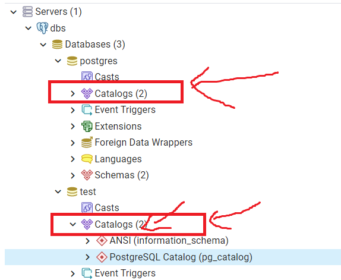
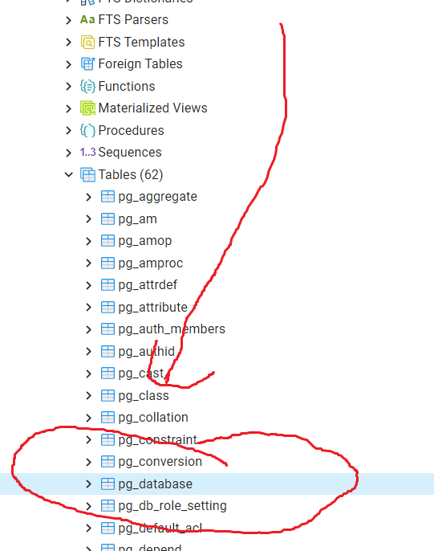
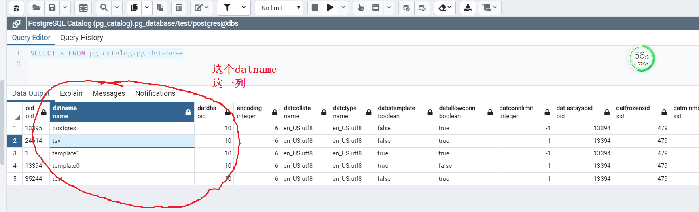
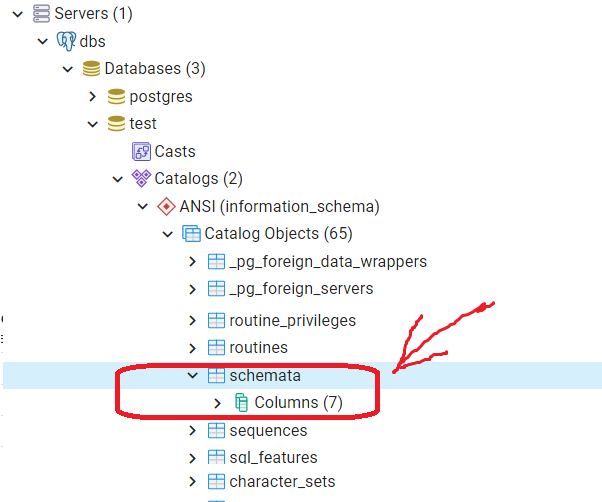
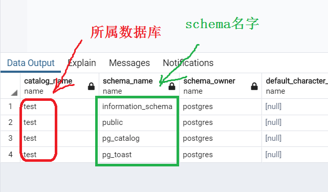
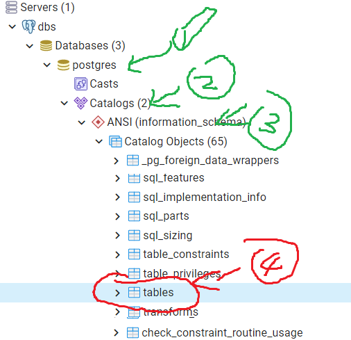
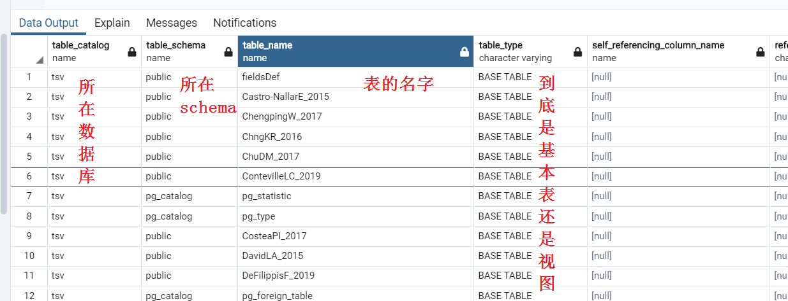

# 现在开始针对需求深入挖掘PostgreSQL的功能/性能

## 第一个问题(动态增加列的问题)

### 首先

我们创建一个表，新增1列。叫做f1：字段类型性为字符串。

然后，添加一个数据行。

### 接下来

我们为这个表新增加1列，列名叫做f2：字段类型也是字符串。

接下来，我们让这个字段为 **必须输入型(不能为null)** 。

### 问题

我们这个办法对以前已经存在的数据行，将产生什么影响。

### 答案

如果为这个新字段补充一个默认值的话，默认值将会自动补填到原有行的新字段中。

# 关于null

## 查询条件

在查询条件中 `where conditionalColumn=null`，这是不允许出现的。

必须改写成：

```sql
where conditionalColumn is null
或者
where conditionalColumn is not null
```

## 但是设置值的时候可以在等号后面

```sql
UPDATE public.t1
	SET b=null
	WHERE id=2;
```
上面的是合法的。

# 字符串分三种

| 类型       | **varchar(n)**                                 | **char(n)**               | **text**             |
| ---------- | ---------------------------------------------- | ------------------------- | -------------------- |
| 占用的空间 | 预先分配定长n                                  | 预先分配定长n             | 插入/修改时分配      |
| 内部的值   | 内部的字符串还有一个有效长度，所以不做任何填充 | 长度不足n的部分，填充空格 | 和**varchar(n)**相同 |
| 长度限制   | 不超过n                                        | 不超过n                   | 不限制               |

# boolean的值也分三种

true,false和null。

null:解释为unknow。

# PostgreSQL支持的特有的数据类型

## 枚举类型

### 创建枚举类型

```sql
//情绪分为：悲、常、喜
CREATE TYPE mood AS ENUM ('sad', 'ok', 'happy');
```

看起来像是字符串。

## 复合类型

这就是字段再分的一些思想了。

其实是字段可以含有成员。

## 数组

单个的字段值还可以是数组。

**查询**的时候，可以使用数组加下标的形式来根据数组中某个元素用于查询条件。

**更新**的时候，只能是字段值整体更新。

# PostgreSQL特有的系统表

## 系统表位于哪里



## 枚举所有数据库

### 位置



### 查询语句

```sql
SELECT * FROM pg_catalog.pg_database
```

### 效果



## 枚举出特定数据库下有多少SCHEMA

其实每个SCHEMA都是一个名字空间而已。

### 位置



### 查询

```sql
SELECT * FROM information_schema.schemata
```

### 效果



## 枚举出特定数据库下有多少可查询的表

### 位置




### 查询

```sql
SELECT * FROM information_schema.tables
```

### 效果

