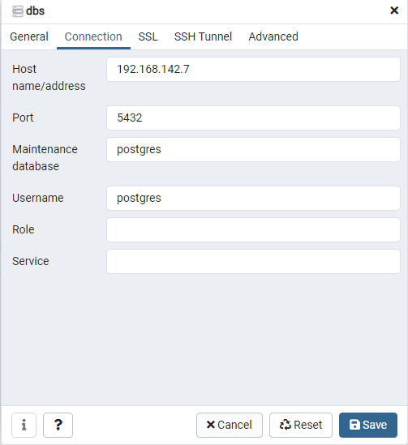

# GUI管理入口

[http://192.168.142.7:5433/](http://192.168.142.7:5433/)

# 登录账号

## 给万全的账号

```bash
test@test.com:test1234
```

## 何飞使用的账号

```bash
reechand@cust.edu.cn:test1234
```

# 管理程序连接数据库服务器使用的信息



连接使用的密码为：docker

# 样本总库位于何处

## 数据库的名字

```
tsv
```

t:是table的意思。

sv:是取自csv文件中的sv。

也就是csv格式的文本变了一下形式，成为了table的样貌。

## 模式(schema)名字

```
v1
```


## 表的名字

```
samples
```