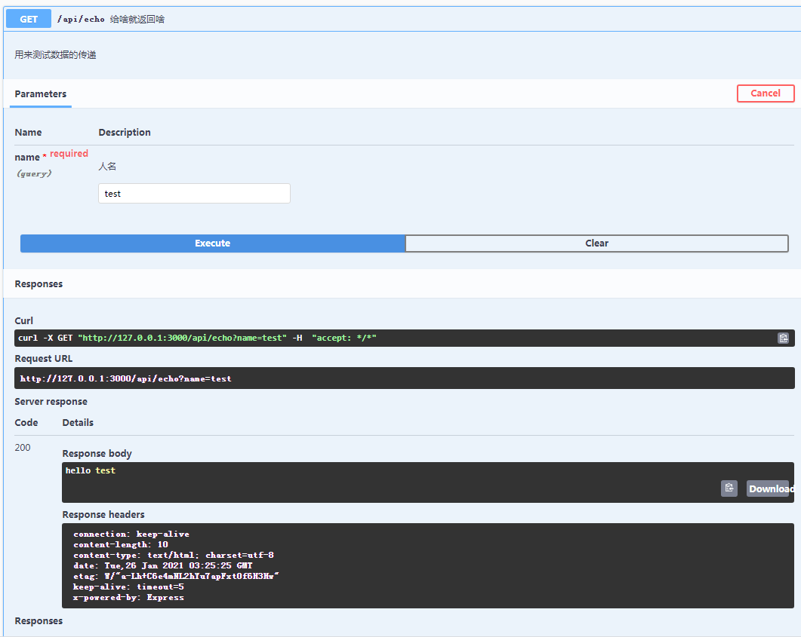

# 什么是入口参数

所谓的入口参数，也就是调用函数的时候由主调传递给被调的数据。

# 源码

## 完整源码

```typescript
/**
 * @swagger
 * /api/echo:
 *   get:
 *     tags:
 *       - test
 *     summary: 给啥就返回啥
 *     description: 用来测试数据的传递
 *     parameters:
 *       - name: name
 *         description: 人名
 *         in: query
 *         required: true
 *         type: string
 *     responses:
 *       "200":
 *         description: 执行成功，会返回提供的参数
 */
router.get('/echo', function (req, res) {
    let name=req.query.name;
    res.send('hello '+name);
});
```

## 我们关注的部分代码

```typescript
 *     parameters:
 *       - name: name
 *         description: 人名
 *         in: query
 *         required: true
 *         type: string
```

## 以上代码的解释

### 这个强调的是对入口参数的定义

```typescript
 *     parameters:
```

### 参数名(注意断线和空格)

每个参数都应该以短线开头进行引导。

```typescript
 *       - name: name
```

### 对参数进行一个简单的文字描述

```typescript
 *         description: 人名
```

### 参数从何处提取(参数来源)

```typescript
 *         in: query
```

其实也可以叫做参数在哪里。

一般而言，主要有三种可用的来源。

①最常用的是：query，意思是从查询字符串中提取。发送的时候在网址中提取，形式是`?参数名=参数值`这种。

②大数据专用的是：body，意思是从post方法中发送。

③还有一种我初次在swagger中发现的是:path，意思是从虚拟路径中提取。
这个时候对虚拟路径的格式就会有要求，比如：`/前缀/api函数名/{参数1}/{参数2}`
这种格式我暂时不打算使用。

至于其他：比如通过header来传递参数，我暂且就不研究了。
除了增加了调试的复杂度之外，缩短了对path长度限制的占用外没有太大的用途。

### 参数的必要性

这个用来说明参数是可选参数，还是必要参数。

```typescript
 *         required: true
```

### 参数的类型

```typescript
 *         type: string
```

# 效果

