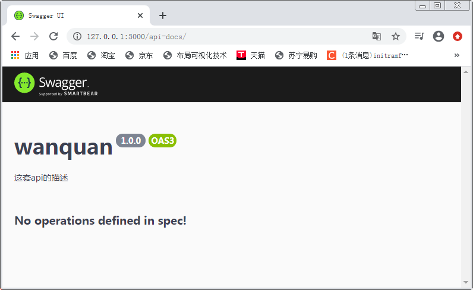

# 什么叫做全局swagger信息设置

就是只要使用swagger就必须进行的设置。因为是全局的一般情况下这是一次就可以了。

所以，这个一般也叫做swagger工程设置。

## 和全局相对应的是什么

那自然是具体了，因为一个具体的API有函数名参数表等信息。

会对应一个具体函数。

## 设置全局信息的步骤是什么

这个步骤会比较乱，但是第一步还是比较清晰和简单的。

主要是有些理论上的概念，需要穿插在步骤中讲解。

# 第一步:安装和引入swagger包

## 理论上

### 要明确需要哪两个包

这两个包分别叫做文档包和UI包。

文档包叫做`swagger-jsdoc`，ui包叫做`swagger-ui-express`。

### 需要明确这两个包之间是什么关系

文档是整个swagger的输入系统，ui是整个swgger的输出系统。

输入系统(jsdoc)负责完成一系列处理，然后在内存中产生一个数据对象叫做 *规范*。
输出系统(ui)则根据内存中的这个规范，借助于express生成网页形式的界面(包括api文档的显示以及api测试代码的生成等)。

### 明确两个包之间的桥梁是什么

两个包之间的桥梁就是上面提到的 *规范*。

## 安装

```bash
npm install swagger-jsdoc  -S
npm install swagger-ui-express  -S
```

## 引入

```typescript
import doc=require("swagger-jsdoc");
import ui=require("swagger-ui-express");
```

# 第二步：定义swagger的全局选项(options)

## 此处需要用到一个包叫做path

先引入进来

```typescript
import path=require("path");
```

## 选项声明的源码及解释

```typescript
//3.swagger的全局选项/工程选项
const swaggerOptions={
    definition:{
        //OpenAPI的版本：我们使用最新的3.0版本
        openapi:'3.0.0'
        //其它显示给使用者的全局信息
        ,info:{
            //这套api的名字：万全
            title:"wanquan"
            //这套api的版本1.0.0
            ,version:'1.0.0'
            ,description:"这套api的描述"
        }
    }
    //这个就很重要了，它决定了从哪里提取api的规范信息
    ,apis:[path.join(__dirname,'router/*.js')]
}
```

# 第三步:使用文档(输入系统)生成内存中的数据对象规范

```typescript
const spec = doc(swaggerOptions);
```

# 第四步：根据规范生成网页界面

```typescript
app.use("/api-docs", ui.serve, ui.setup(spec));
```

# 测试效果

## 访问网址

[http://127.0.0.1:3000/api-docs/](http://127.0.0.1:3000/api-docs/)

## 显示的内容



