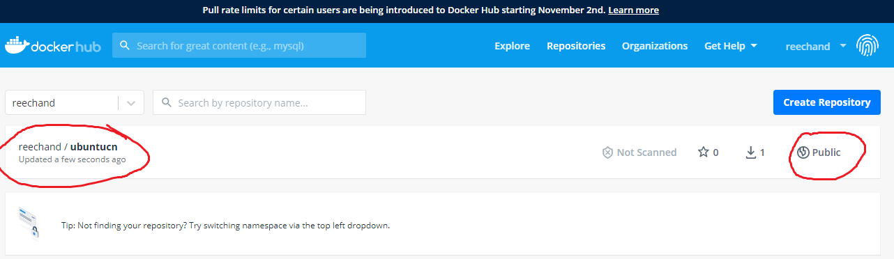
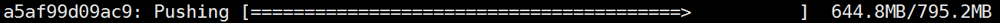

# 注册docker-hub的账号


# 推送image的规范

## 理论讲解

### image命名要求

必须是username/imagename。

我的注册名是reechand,所以推送的所有image必须是reechand/开头的。

### 必须先登录

登录很简单。只需要输入docker login。然后输入用户名和密码就可以了。然后，就和平时使用没有区别了。

# 实操

## 我有个image名字是ubuntucn

```bash
ubuntucn                                    latest              dca07b1ce281        2 weeks ago         238MB
```

### 设置别名

```bash
docker tag ubuntucn reechand/ubuntucn
```

## 推送

```bash
time docker push reechand/ubuntucn
```

### 结果

```bash
The push refers to repository [docker.io/reechand/ubuntucn]
36188ac46a90: Pushed 
544a70a875fc: Mounted from library/ubuntu 
cf0f3facc4a3: Mounted from library/ubuntu 
132bcd1e0eb5: Mounted from library/ubuntu 
d22cfd6a8b16: Mounted from library/ubuntu 
latest: digest: sha256:e4b27674633c85200e3e4189c3069920fc288454e159eadd4e5496a5f48f359a size: 1364

real	1m2.829s
user	0m0.040s
sys	0m0.028s

```

1分钟就算推送过去了。

还不错。



# 综合服务器的测试

## 停止综合服务器

```bash
docker stop quan-comprehensive-server
```

## 导出成为镜像文件

```bash
docker export -o test.tar quan-comprehensive-server
```

## 查看内容大小

```bash
ll test.tar -h
```

### 结果

```bash
-rw------- 1 hf hf 789M 12月 30 08:17 test.tar
```

## 导入成为映像

```bash
docker import test.tar reechand/quan
```

### 大小

```bash
REPOSITORY                                  TAG                 IMAGE ID            CREATED             SIZE
reechand/quan                               latest              1f39d1fda1fa        9 seconds ago       795MB
```

## 推送

### 进度



### 注意

这跟此前的推送进度有些不同。此前好像是分层推送的。

这是一股脑儿一起推送的。

总得来讲，速度还是可以。

```bash
The push refers to repository [docker.io/reechand/quan]
a5af99d09ac9: Pushed 
latest: digest: sha256:3de3a641aa1df2dd0663e3d84a5431b17d0b117d341b48cc79e01b2c5d4928d0 size: 529

real	1m48.476s
user	0m0.091s
sys	0m0.023s

```


