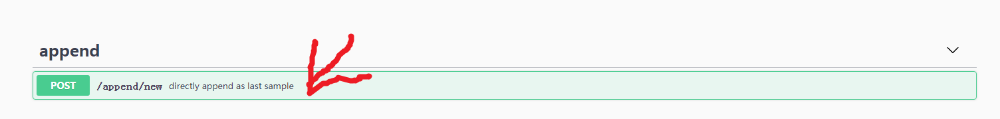
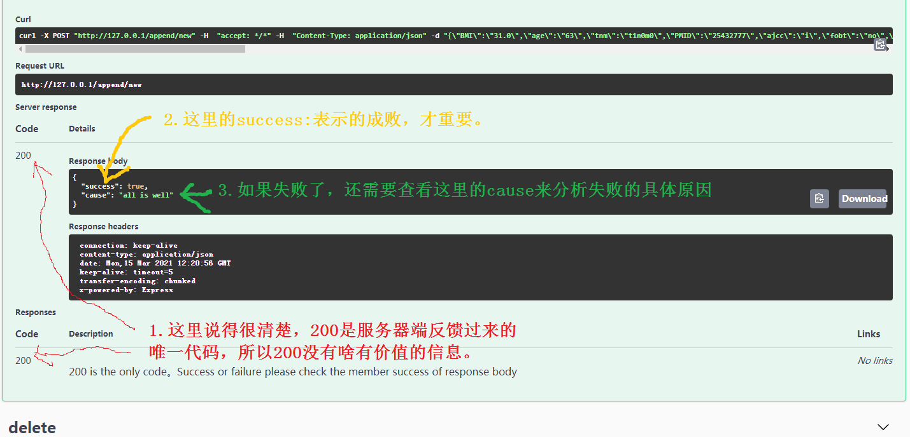
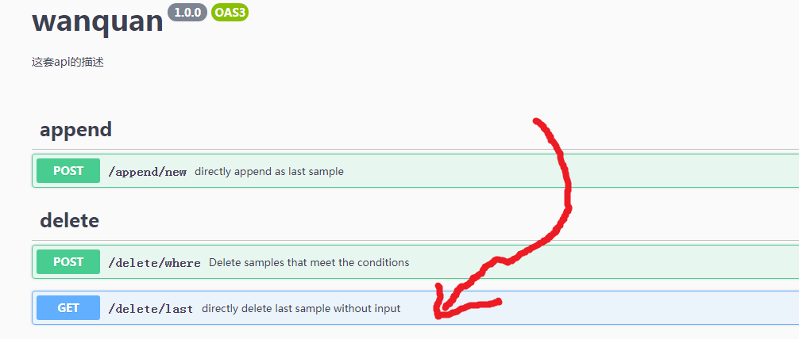

# 为什么要把增加和删除放在一起演示

因为先增加接下来把增加的样本删除掉，这样可以使得测试之后的状态和测试之前保持一致。

便于多次展开测试。

# 添加样本

## 找到入口

### 网址

[http://127.0.0.1/api-docs/#/](http://127.0.0.1/api-docs/#/)

### 点击页面位置

## 准备数据

### 找到数据输入入口

### 输入样本数据

## 插入样本

### 发送样本数据到服务器

### 查看服务器端给予的反馈

# 查看最新添加的样本

## 找到入口

## 接下来

## 最后

## 结果

显示的正好就是在[这一步](#输入样本数据)填写的样本数据。

# 删除最新添加的样本

## 找到入口

## 后续操作

略

## 结果

意味着，我们刚刚添加的样本已经成功地删除掉了。